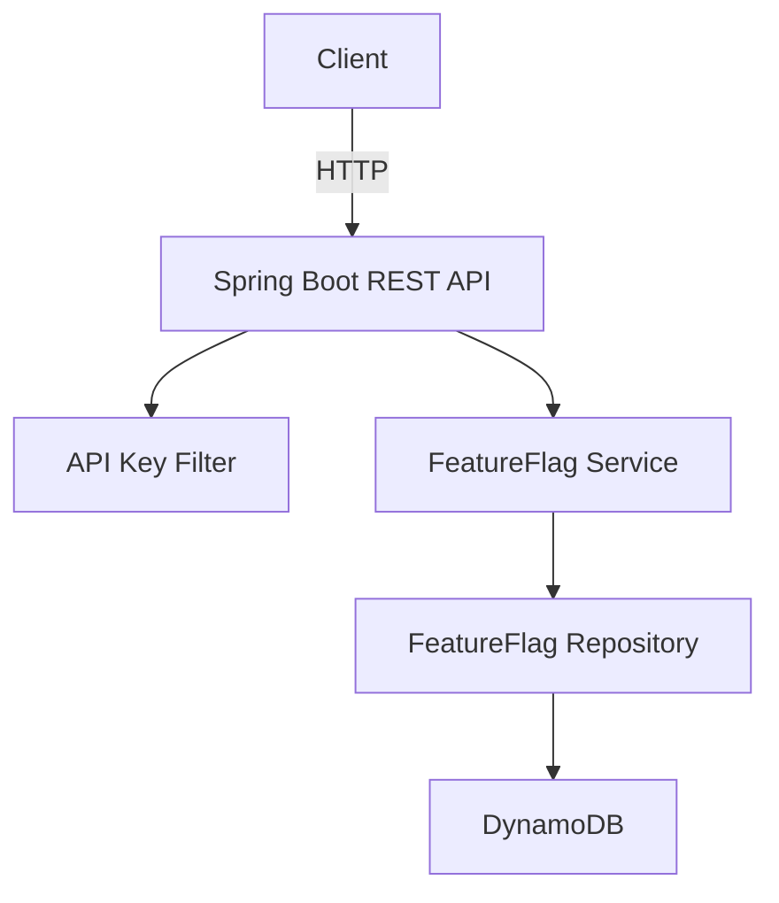

# 🚀 DIY Feature Flag Service (Spring Boot + DynamoDB)

A fully working Spring Boot microservice to manage Feature Flags using AWS DynamoDB. Includes API key authentication and support for create, retrieve, and delete operations.

---

## 📦 Features
- ✅ CRUD API for feature flags
- ✅ DynamoDB integration
- ✅ Simple API Key authentication
- ✅ Docker-ready for local DynamoDB testing

---

## 🧠 Architecture



---

## 🔧 Setup Instructions

### ✅ Prerequisites
- Java 17+
- Docker
- Maven

### 🐳 Run Local DynamoDB
```bash
docker run -p 8000:8000 amazon/dynamodb-local
```

### ⚙️ Run the Application
```bash
./mvnw spring-boot:run
```

### 🔐 Authentication
Use header `X-API-KEY: secret-api-key` in all requests

### 📘 Example API Request

```bash
curl -X POST http://localhost:8080/flags \
 -H 'Content-Type: application/json' \
 -H 'X-API-KEY: secret-api-key' \
 -d '{"name": "new-ui", "enabled": true}'
```

---

## 🧪 Endpoints

| Method | Path            | Description            |
|--------|------------------|------------------------|
| POST   | /flags           | Create or update flag  |
| GET    | /flags/{name}    | Retrieve flag status   |
| DELETE | /flags/{name}    | Delete flag            |

---

## 📜 License

MIT License
